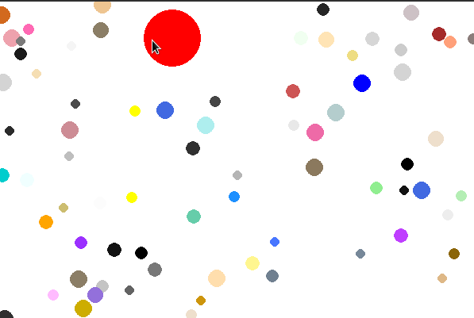

# Игры на PyGame

Почему бы немного не подурачиться, и не поразрабатывать всякие игры
на питоне? Правильный ответ — нет никаких причин для того, чтобы
отказываться от такого удовольствия! Здесь находятся всякие мини-игры на
pygame.

## Машинки

Управление:

- Пробел — начать игру
- Стрелочка влево — переместиться влево
- Стрелочка вправо — переместиться вправо
- C/Escape — завершить игру

## Agario

Управление происходит с помощью мышкой: персонаж всегда идёт в
сторону, где она находится (при этом необходимо, чтобы курсор
находился внутри окна игры). Закрытие игры происходит по нажатию
клавишы C или Escape.

